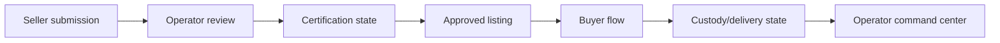

# A2 Watch Marketplace Showcase

## Overview

Architecture and implementation showcase for a watch marketplace concept covering seller submissions, authentication/certification workflow, custody and delivery logic, operator controls, and auction planning.

Production launch is not represented.

## Problem

A watch marketplace needs more than product listings. It needs trust workflows, item verification, seller intake, custody and delivery states, operator review, and clear boundaries around returns and certification.

## Technical Approach

- Separate seller submission from public product publishing.
- Review queue for operator verification.
- Certification status model for high-value items.
- Custody/delivery state machine.
- Operator command center for exceptions.
- Auction concept documented separately from production status.

## Key Features

- Seller submission
- Authentication/certification workflow
- Custody/delivery/no-return flow design
- Operator command center
- Auction concept
- Honest MVP/runtime status

## Performance / Business Impact

Representative architecture case study. No production KPI is claimed.

## Architecture

## Code Samples

- `samples/sample-service-class.php`

## Security & Privacy Notes

This repository must not include private seller data, verification rules that can be abused, payment credentials, internal dispute workflows, or unreleased business strategy.

## Tech Stack

PHP, WordPress, WooCommerce, MySQL, REST API, JavaScript.

## Related Links

- Portfolio: https://amiraliyaghouti.com
- GitHub profile: https://github.com/shiny-a2

