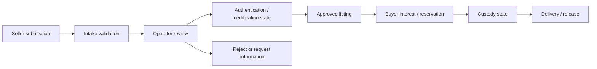

# A2 Watch Marketplace Showcase

Architecture and implementation showcase for watch marketplace workflows.

Production launch is not represented.

## Overview

A watch marketplace is not only a product listing problem. The difficult parts are seller intake, verification state, custody and delivery transitions, operator review, trust boundaries, and exception handling.

## Production Context

- High-value items require more trust control than ordinary catalog products.
- Seller-submitted data must not move directly into public listings.
- Operators need review queues and status clarity.
- Auction concepts and custody workflows need honest runtime boundaries.

## Problem

Marketplace workflows can become unsafe if seller submissions, verification, publishing, custody, delivery, and dispute states are treated as one simple product CRUD flow.

## Operational Constraints

- Do not claim production launch or production readiness.
- Do not expose private seller verification rules.
- Do not publish payment, dispute, or sensitive custody procedures.
- Keep the public repository architecture-focused.

## Scaling Challenges

- Review queues need state transitions that operators can trust.
- Marketplace listings require stronger validation before publishing.
- Custody and delivery states must prevent invalid transitions.
- Auctions add timing and fairness concerns that should be isolated from the base listing model.

## Architecture Decisions

- Separate submission, review, certification, listing, reservation, custody, and delivery states.
- Use an explicit state machine for transitions.
- Keep operator review separate from public listing visibility.
- Treat auction functionality as a future module, not a hidden production claim.

## Workflow Map

## Tradeoffs

- A strict state machine reduces flexibility but prevents unsafe transitions.
- Keeping verification rules private protects the marketplace from abuse.
- Separating auction concepts slows launch scope but makes the core workflow easier to reason about.
- Public documentation can show architecture without exposing operational playbooks.

## Failure Prevention

- State transition validation.
- Operator-only review actions.
- No direct seller-to-public publishing path.
- Clear separation between concept, MVP, and production launch status.
- Public samples omit sensitive verification and payment details.

## Performance Strategy

This is an architecture showcase, so no production performance KPI is claimed. If implemented, the expected performance strategy would be review-queue pagination, bounded dashboard reads, cached public listing views, and isolated auction timers.

## Operational Learnings

- Marketplaces are trust systems before they are catalog systems.
- State design matters more than UI volume early in the project.
- Public case studies should be honest about runtime status.

## Future Improvements

- Add sanitized UI state diagrams.
- Add a sample queue repository for review dashboards.
- Add a public ADR explaining why auction workflows are separated.

## Code Samples

- state transition service;
- review queue repository;
- policy service for safe public decisions.

## Engineering Notes

- [Marketplace state machine before payments](docs/engineering-notes/marketplace-state-machine-before-payments.md)
- [Custody, authenticity, and settlement boundaries](docs/engineering-notes/custody-authenticity-and-settlement-boundaries.md)

## Infrastructure Notes

- [Request lifecycle](docs/infrastructure/request-lifecycle.md)
- [Observability and instrumentation](docs/infrastructure/observability-and-instrumentation.md)
- [Failure mode matrix](docs/infrastructure/failure-mode-matrix.md)
- [Infrastructure samples](samples/infrastructure)

## Security & Privacy Notes

No seller data, verification rules, payment details, dispute procedures, custody process details, or private business strategy are included.

## Tech Stack

PHP, WordPress, WooCommerce, MySQL, REST API, JavaScript.

## Related Links

- Portfolio: https://amiraliyaghouti.com
- Projects: https://amiraliyaghouti.com/projects.html
- GitHub profile: https://github.com/shiny-a2
