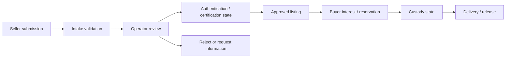

# A2 Watch Marketplace Showcase

Architecture and implementation showcase for watch marketplace workflows.

Production launch is not represented.

## Reviewer Shortcut

This repo demonstrates marketplace architecture through public-safe state design, not a production launch claim. It relates to seller intake, operator review, certification, reservation, custody, certificate visibility, and settlement boundaries. It proves state-machine thinking, trust boundaries, idempotency, and failure-mode awareness. Start with `docs/infrastructure`, `docs/engineering-notes`, and `samples/infrastructure`. This is a showcase repository, not a production package.

## Overview

A watch marketplace is not only a product listing problem. The difficult parts are seller intake, verification state, custody and delivery transitions, operator review, trust boundaries, and exception handling.

## Production Context

- High-value items require more trust control than ordinary catalog products.
- Seller-submitted data must not move directly into public listings.
- Operators need review queues and status clarity.
- Auction concepts and custody workflows need honest runtime boundaries.

## Problem

Marketplace workflows can become unsafe if seller submissions, verification, publishing, custody, delivery, and dispute states are treated as one simple product CRUD flow.

## Operational Constraints

- Do not claim production launch or production readiness.
- Do not expose private seller verification rules.
- Do not publish payment, dispute, or sensitive custody procedures.
- Keep the public repository architecture-focused.

## Scaling Challenges

- Review queues need state transitions that operators can trust.
- Marketplace listings require stronger validation before publishing.
- Custody and delivery states must prevent invalid transitions.
- Auctions add timing and fairness concerns that should be isolated from the base listing model.

## Architecture Decisions

- Separate submission, review, certification, listing, reservation, custody, and delivery states.
- Use an explicit state machine for transitions.
- Keep operator review separate from public listing visibility.
- Reuse the host storefront identity while keeping marketplace roles and dashboards module-specific.
- Keep OTP proof, account reuse, and marketplace authorization as separate steps: a successful code proves identity, then the module attaches its buyer role and resolves the correct buyer/seller dashboard.
- Use progressive AJAX for authentication with a complete server-rendered form fallback; both paths share one validation and session contract.
- Treat shared object cache as an acceleration layer, never as the sole source of truth for a multi-request OTP flow.
- Reserve each verification attempt and consume a correct OTP as atomic, generation-bound state transitions.
- Keep unauthenticated SMS budgets in durable atomic IP/mobile buckets so cache eviction or parallel requests cannot turn provider cost controls into fail-open checks.
- Source seller/operator brand choices from one canonical taxonomy so public facets remain deterministic.
- Treat auction functionality as a future module, not a hidden production claim.

## Workflow Map

```mermaid
flowchart LR
    Seller[Seller submission] --> Intake[Intake validation]
    Intake --> Review[Operator review]
    Review --> Cert[Authentication / certification state]
    Cert --> Listing[Approved listing]
    Listing --> Buyer[Buyer interest / reservation]
    Buyer --> Custody[Custody state]
    Custody --> Delivery[Delivery / release]
    Review --> Reject[Reject or request information]
```

## Tradeoffs

- A strict state machine reduces flexibility but prevents unsafe transitions.
- Keeping verification rules private protects the marketplace from abuse.
- Separating auction concepts slows launch scope but makes the core workflow easier to reason about.
- Public documentation can show architecture without exposing operational playbooks.
- Reusing authentication reduces duplicate identities, but marketplace authorization still needs its own explicit role boundary.

## Failure Prevention

- State transition validation.
- Operator-only review actions.
- No direct seller-to-public publishing path.
- Authentication pages bypass public full-page caches so embedded nonces cannot outlive their security window.
- Pending login state must be durable before an OTP is sent; otherwise a delivered code can never advance the visitor to verification.
- A stale worker cache must never revive a consumed token, and concurrent guesses must not bypass the per-code attempt limit.
- If the durable rate-limit store cannot reserve a slot, stop before contacting the SMS provider.
- Clear separation between concept, MVP, and production launch status.
- Public samples omit sensitive verification and payment details.

## Performance Strategy

This is an architecture showcase, so no production performance KPI is claimed. If implemented, the expected performance strategy would be review-queue pagination, bounded dashboard reads, cached public listing views, and isolated auction timers.

## Operational Learnings

- Marketplaces are trust systems before they are catalog systems.
- State design matters more than UI volume early in the project.
- Public case studies should be honest about runtime status.
- Fixed mobile navigation layers must be coordinated: a module-level bar hidden behind the host bar is functionally absent even when its markup exists.
- An interface that looks asynchronous still needs an explicit JSON contract, in-place state transition, safe error handling, and a no-JavaScript fallback; a redirect-only form is not an AJAX flow.
- Cache acknowledgement is not proof of cross-request durability. OTP state needs a durable source of truth plus conditional updates so provider failures, retries, and parallel verification requests cannot overwrite newer generations.

## Future Improvements

- Add sanitized UI state diagrams.
- Add a sample queue repository for review dashboards.
- Add a public ADR explaining why auction workflows are separated.

## Code Samples

- state transition service;
- review queue repository;
- policy service for safe public decisions.

## Engineering Notes

- [Marketplace state machine before payments](docs/engineering-notes/marketplace-state-machine-before-payments.md)
- [Custody, authenticity, and settlement boundaries](docs/engineering-notes/custody-authenticity-and-settlement-boundaries.md)
- [Offers, settlement, notifications, and verification boundaries](docs/engineering-notes/offers-settlement-notifications-and-verification.md)

## Infrastructure Notes

- [Request lifecycle](docs/infrastructure/request-lifecycle.md)
- [Observability and instrumentation](docs/infrastructure/observability-and-instrumentation.md)
- [Failure mode matrix](docs/infrastructure/failure-mode-matrix.md)
- [Infrastructure samples](samples/infrastructure)

## Quality Signal

- [Quality signal notes](docs/quality-signal.md)
- [Sample PHP syntax workflow](.github/workflows/sample-php-lint.yml)
- [Samples directory](samples)

## Related Technical Writing

- [Model Marketplace State Before Payment Implementation](https://github.com/shiny-a2/shiny-a2/blob/main/docs/technical-writing/articles/marketplace-state-before-payments.md)

## Security & Privacy Notes

No seller data, verification rules, payment details, dispute procedures, custody process details, or private business strategy are included.

## Tech Stack

PHP, WordPress, WooCommerce, MySQL, REST API, JavaScript.

## Related Portfolio

- Portfolio: https://amiraliyaghouti.com
- Projects: https://amiraliyaghouti.com/projects.html
- Case studies: https://amiraliyaghouti.com/case-studies.html
- GitHub profile: https://github.com/shiny-a2
