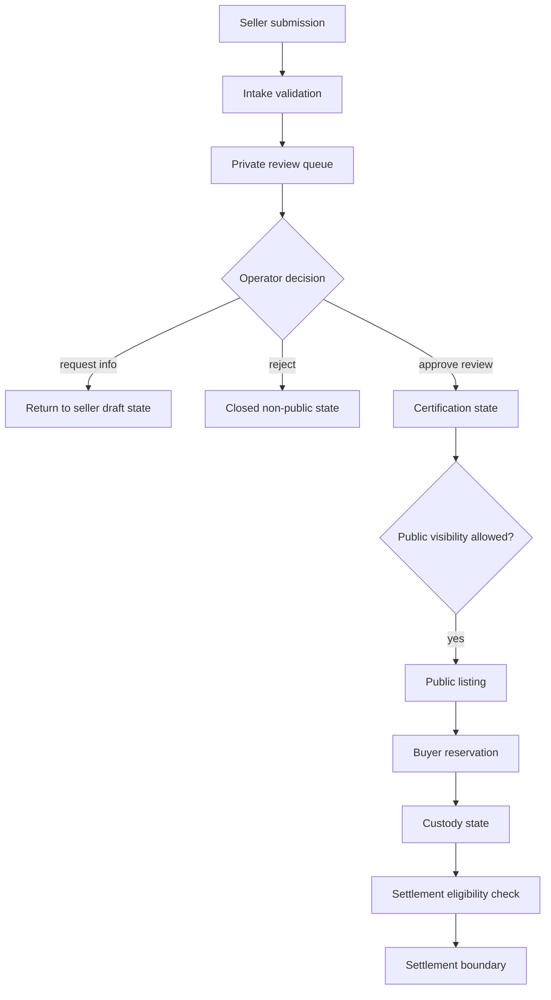

# Request Lifecycle

The marketplace path is a state-transition system before it is a payment or listing system.

## Operating Notes

- Seller submissions should not become public listings automatically.
- Reservation and custody changes need idempotency and state checks.
- Certificate/public visibility is a separate decision from internal verification work.
- Settlement should wait for final custody and review boundaries.

